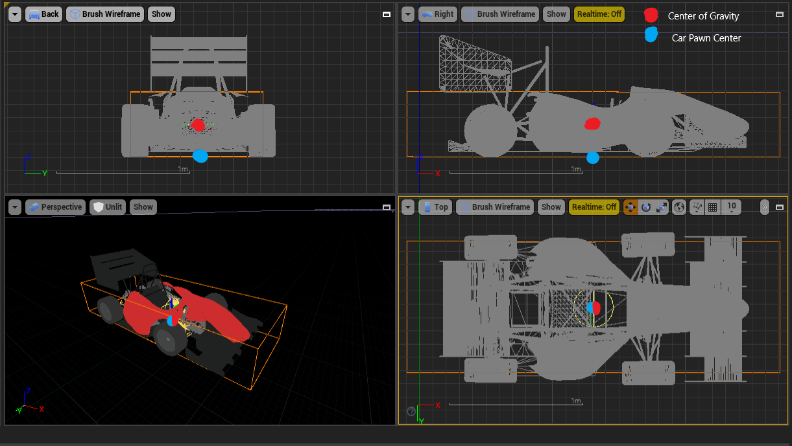
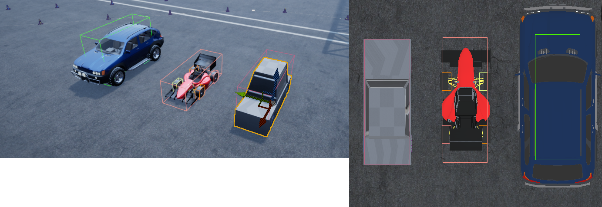

# Vehicle Dynamic model

One of the most controversial subjects of any simulator is the vehicle dynamic model. This is the piece of the simulation that actually changes the state of the vehicle. 
In building this simulator for the FSOnline competition, our design philosophy was the following:

* **All teams will use the same vehicle dynamic model**. We are well aware that all teams have put effort into developing dynamic models of their own FSCar for controls and simulation purposes. However, we want the FSOnline DV Dynamic event to purely be a battle of autonomous software. Even if this will require teams to tweak their path planning and control algorithms, it will make sure that the winner of this event is truly the team that can take any race car and push it to its limits the most.

* **The dynamic model will have a high enough fidelity such that it is virtually impossible to overfit to it/reverse the plant or run open loop**. This will force teams to use system identification techniques similar to the ones that are used on a real car and no cheating or unfair advantage will be given to any teams.

* **A third-party, open-source model would be ideal**. This way, not even the developers of the simulation (Formula Student Team Delft) would have an edge over other teams. Everyone has access to the same code and has had no experience working with it or been involved in developing it.

Unreal Engine provides the [PhysXVehicles](https://docs.nvidia.com/gameworks/content/gameworkslibrary/physx/guide/Manual/Vehicles.html) that was developed by Nvidia. 
This seemed like the perfect solution for our simulator, given that it complies with all the criteria of our design philosophy above. 
Airsim simply interacts with the PhysXCar API in [these](https://github.com/FS-Online/Formula-Student-Driverless-Simulator/tree/master/UE4Project/Plugins/AirSim/Source/Vehicles/Car) files.

## Vehicle pawn center

Just like everything inside the simulated world, the vehicle has a position within the world (x, y, z).
Relative to this point the rest of the vehicle is constructed.
The collision box, the center of gravity and the sensor positions all are relative to this center point.

The center position is located at the bottom of the car and on the horizontal plane in the geometric center.
When car is stationary the height offset between the world track and the pawn position is 0.
In below image the blue dot represents the location of the pawn center:

_Vehicle Layout Overview_

## Vehicle collision model

The collision model (bounding box) defines which parts of the car interact with other parts of the world.
The default vehicle (TechnionCarPawn) has the following bounding boxes:

* Width: 100cm
* Length: 180cm
* Height: 50cm

The bounding boxes will be centered ontop of the vehicle pawn center. 
In the Vehicle Layout Overview picture above the orange lines show the bounding box. 
These boundries are unrealted to the vehicle 3d model.
The car may look smaller or bigger but they will hit cones all the same.

## Vehicle center of gravity

The center of gravity of the car sits in the center of the collision model.
The center of gravity of the default vehicle (TechnionCarPawn) is 25cm above the vehicle pawn center.
In turn, when the car is stationary, the height offset between the world ground and the center of gravity is 25 cm.
Within the _Vehicle Layout Overview_ picture the red dot represents the center of gravity.

## More properties of competition vehicles

* Mass: 255 kg
* Max speed: ~27 m/s
* Drag coefficient: 0.3 [-]

# How to configure vehicle properties?

All vehicle proprties are set in the unreal vehicle pawn classes.
You can view and edit these configuratoin files using the Unreal Editor in `/UE4Project/Plugins/AirSim/Content/VehicleAdv/`.

